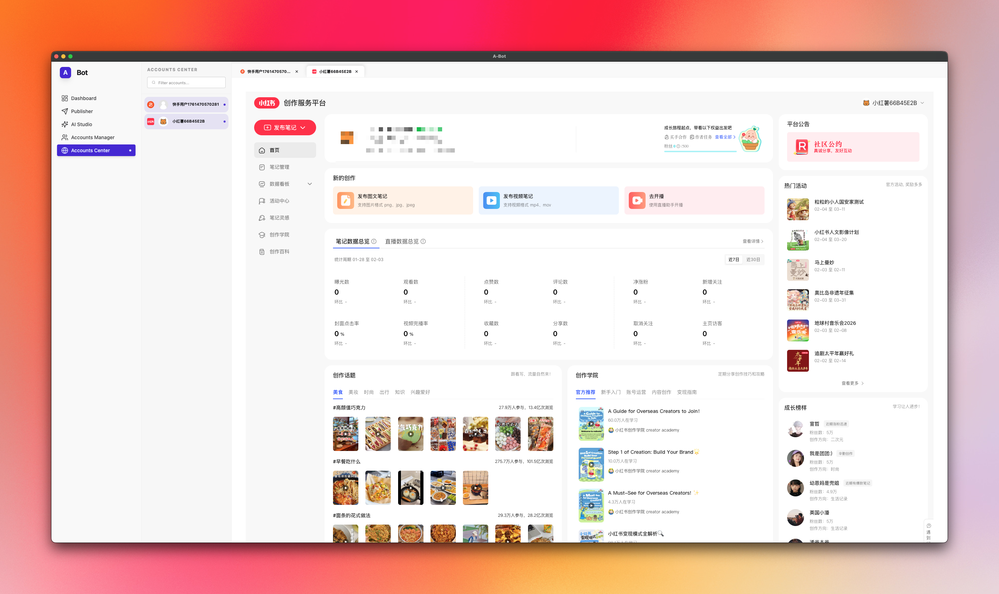

# automation-ts

  

> [!NOTE]
> The publish part is not workable now

Electron desktop application (not a CLI) built with Vite, Bun, and TypeScript.

This repository contains a desktop application powered by Electron for the shell, Vite for the renderer tooling and bundling, and Bun as the JavaScript runtime and package manager. It is a GUI desktop app — not a command-line tool.

Tech stack

- Electron
- Vite
- Bun
- TypeScript

Getting started

Prerequisites

- Bun (https://bun.sh/) installed (recommended). A recent Node.js installation should also work for some environments, but this project is intended to use Bun.

Install dependencies

bun install

Development

Use the development scripts defined in this project's package.json. Typical workflow:

1. bun install
2. bun run dev

The development script usually starts the Vite dev server for the renderer and launches Electron for the desktop shell. Check package.json scripts for exact commands.

Build

Build steps vary depending on how packaging is configured in this repo. Common commands:

- bun run build # builds renderer (Vite) and main process bundles
- bun run package # packages the app for distribution (if available)

Run production build locally

- bun run start

Notes

- This is a desktop Electron application — do not treat it as a CLI tool.
- Vite is used to develop and bundle the renderer (web) portion of the app for fast HMR during development.
- Bun is used as the runtime and package manager for faster installs and startup.

Contributing

Contributions welcome. Please open issues or pull requests and follow the repository guidelines.

License

MIT
